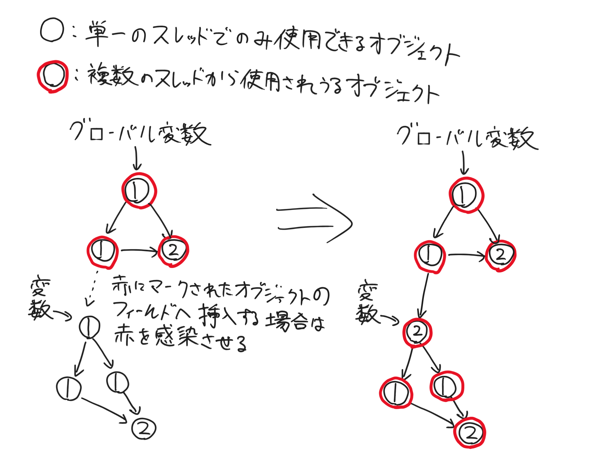
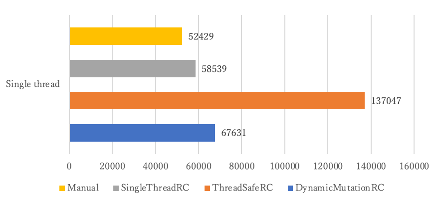
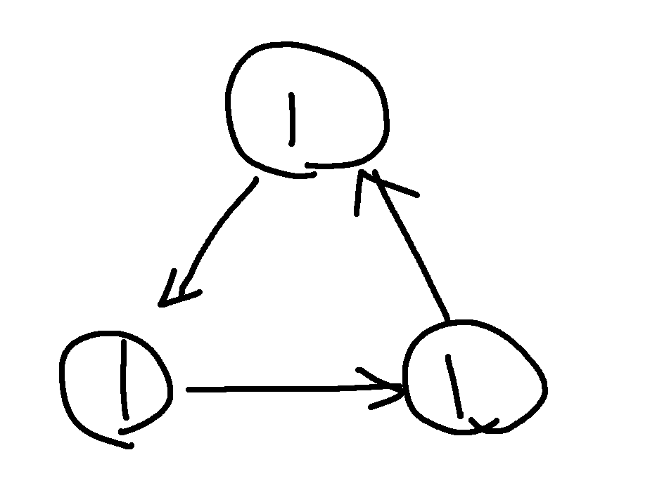
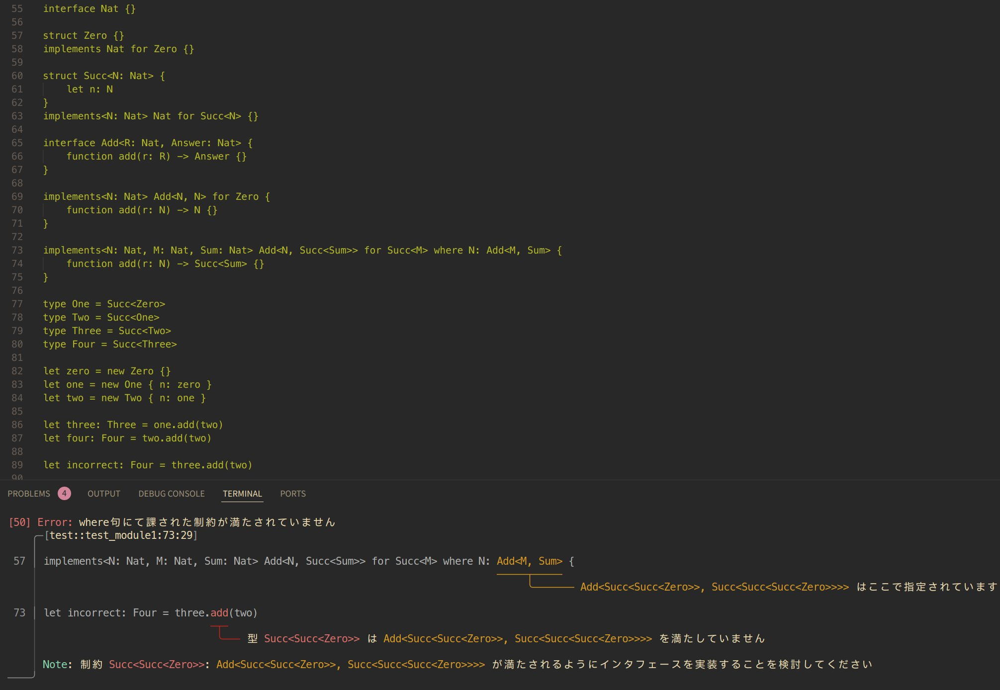
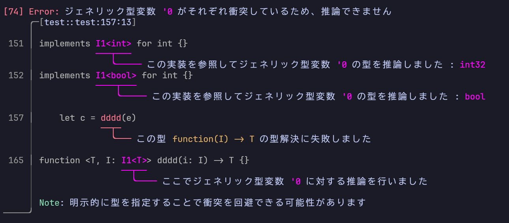

# プログラミング言語 Catla

---


# 自己紹介
* `bea4dev`
* 22 y.o. 大学生
* Rust / Java / Kotlin / C++ などを主に書いています

---

# プログラミング言語 Catla

---

# Rustへトランスパイル
何が嬉しいのか(モチベーション)
- Rustからサクッと切り替えたい(C++とPython的な関係)
- Shared XOR Mutabilityから一時的に開放して欲しさ(UIとか)
- `cargo add`とか`cargo install`とかで入ってほしい
- **実行速度が速い**(ただしGCの実装を工夫する必要がある)
- Rustの`&mut T` `Rc<RefCell<T>>` `Arc<Mutex<T>>`を良い感じに何とかしてほしい

---

# メモリ管理戦略
決定論的な動きをしてほしいので基本は参照カウント
ただしそのまま`Arc<Mutex<T>>`に置き換えると遅い
スレッドセーフな参照カウントは遅い

---
<!-- https://ravendb.net/articles/atomic-reference-counting-with-zig-code-samples -->
# スレッドセーフな参照カウント
ABA問題を起こさないためにロックが必要(アトミック命令だらけに...)
```ts
class Object {
    _ref_count: AtomicUsize;
    _spin_lock: SpinLock;
    field: Object;

    // フィールドにあるオブジェクトを取得する関数的なもの
    function _get_field() -> Object {
        // ここでアトミック命令
        this._spin_lock.lock();

        let field_object = this.field;
        // ここもアトミック命令
        field_object._ref_count.fetch_add(1, Ordering::Relaxed);

        // ここでもアトミック命令
        this._spin_lock.unlock();

        return field_object;
    }
}
```

---
<!-- https://yamasa.hatenablog.jp/entry/2020/12/07/041649 -->
# アトミック命令とx86系CPU
x86は**強いメモリモデル**
RMW命令がデフォルトで一番強い制約を持つ`SeqCst`セマンティックを持つ
実際に必要なセマンティックよりも強いもので実行され、最適化の機会を失う

**\>> 結果的に大幅にパフォーマンスが下がる要因になる**

> Swift等の参照カウントを採用する言語では実行時間の大半が参照カウントの実行に費やされるというケースもあるらしい

> 参照カウントが遅いと言われる理由は多分ほぼコレが原因

## > どうにかしてアトミック命令を削減したい

---

# 複数のスレッドからアクセスされうるものにマーク


---

# フラグを持たせてみる
```ts
class Object {
    _ref_count: AtomicUsize;
    _spin_lock: SpinLock;
    _is_mutex: bool; // <== 複数のスレッドから共有されうるかどうかを表す
    field: Object;

    function _get_field() -> Object {
        if this._is_mutex {
            this._spin_lock.lock(); // <== 複数のスレッドからアクセスされうるのでロックが必要
            ...
        } else {
            // <== こっちは必要ない
            ...
        }
    }
}
```

---

# オブジェクトをフィールドにセットする場合
```ts
class Object {
    _ref_count: AtomicUsize;
    _spin_lock: SpinLock;
    _is_mutex: bool; // <== 複数のスレッドから共有されうるかどうかを表す
    field: Object;

    function _set_field(new_object: Object) {
        if this._is_mutex {
            new_object.to_mutex(); // <== 挿入先がmutexなのでこちらもフラグを立てる(汚染)

            this._spin_lock.lock();
            ...
        } else {
            // <== こっちはフラグを立てなくて良い
            this.field = new_object;
            ...
        }
    }
}
```
---

# カウントのインクリメント
```ts
class Object {
    _ref_count: AtomicUsize;
    _spin_lock: SpinLock;
    _is_mutex: bool;
    field: Object;

    function _add_ref_count() {
        if this._is_mutex {
            this._ref_count.fetch_add(1, Ordering::Relaxed); // <== アトミック命令で加算
        } else {
            *(&this._ref_count as *usize) += 1; // <== 通常の命令で加算
        }
    }
}
```

---


# 本当に安全？
* `_is_mutex`はそのまま取得しても良いの？
* 結局`_is_mutex`の取得にロックを要されるのではないか？

## > 前述のコードの時点で既に解決済み

---

# `_is_mutex`が感染する部分に注目してみる
```ts
class Object {
    ...

    function _set_field(new_object: Object) {
        if this._is_mutex {
            new_object.to_mutex(); // <== ここでフラグを立てている

            this._spin_lock.lock();
            ...
            this._spin_lock.unlock(); // <== オブジェクト挿入後のunlockはReleaseセマンティックを持つ
        }
        ...
    }

    function _get_field() -> Object {
        if this._is_mutex {
            this._spin_lock(); // <== ここのlockはAcquireセマンティックを持つ
            let field_object = this.field; // <== lock()とunlock()の間で_is_mutexに関しての前後関係が反映される
            // 他のスレッドでfieldのオブジェクトが取得可能になった段階で既に_is_mutexのフラグが立った状態で観測される
            ...
        }
        ...
    }
}
```

---

# ちゃんと読める
* フラグを立てるときはフィールドにあるオブジェクトも再帰的に立てる
* ただし一度フラグを立てた後は読み取り専用が前提となる
  * 途中で書き換えるには色々同期する必要がありそう
  * そもそも一度複数のスレッドから見えるようにしたオブジェクトを、
    再びシングルスレッドに幽閉する設計のプログラムはほとんどなさそう
  * 書き換えるメリットが見込めないので考えないことにする(安全ではある)
* グローバル変数は`LazyLock`的なものを使えば良い
  * 当然フラグは正しく反映される

---

# 速いのか？
* フラグが立たない限りアトミック命令は使わないのでコストは低い？
* 分岐命令が増えてますが...

## > トイベンチマークで測ってみる

---

# トイベンチマーク
> 巨大な木構造のオブジェクトを作って破棄するプログラム[ns]


x86のアトミック命令の遅さが際立つ...

---

# 割と効果はありそう
* ただし、シングルスレッドのみでの運用なので分岐予測が高精度になってそう
* ただ、経験則として複数のスレッドに共有するオブジェクトは割と早い段階で共有されがち
* なので実アプリケーションでもそこそこ効果はあるはず
* 因みにApple Siliconで計測するともっと差が小さい(恐らくメモリモデルの差)

---

# もっと最適化したい

---

# Escape Analysis的なのもを導入してみたい
* ヒープを避けてスタックにメモリを確保
  * メモリの確保時間が大幅に短縮！
  * キャッシュヒット率アップ！
* でもこの言語はRAIIを遵守しなければならない
  * 決定性のあるメモリ管理戦略に重きを置いている
* RAIIを遵守するにはライフタイムの概念が付き纏う
  * このライフタイムを利用できないだろうか...？

---

# ライフタイム解析

---

# ライフタイム解析
1. オブジェクトが取りうるライフタイムをすべて取得する
2. オブジェクトのライフタイムが満たすべき長さの大小関係をすべて取得する
3. `2`をすべて満たしているかどうかを検査して満たしていなければ、
   短い方をstaticに引き伸ばす
4. `1~3`を収束するまで繰り返す
5. staticライフタイムを持つオブジェクトはヒープに確保する

---

```ts
static let static_object: Object? = null // <== これは言わずもがなstaticライフタイム

function main() {
    let a = new Object { field: null } // stack
    let b = new Object { field: null } // stack
    b.field = a // "d <= a" の条件が要求されるが、これは満たされている

    let c = new Object { field: null } // heap
    let d = new Object { field: null } // heap
    d.field = c // "d <= c" の条件を要求する
    static_object = d // ここでstaticに代入しているの
}
```
* `d.field = c`により`d <= c`の条件が要求される
* `static_object = d`により`static <= d`の条件が要求される
* 上記２つの条件を満たすために`d`と`c`がstaticライフタイムを持つようになり、
  ヒープ上に確保される

---

# 補足
* 実際はここまで厳密なライフタイムを要求しない
  * ライフタイムは関数やループのスコープと一致させるだけで良い
  * スタックへのメモリの確保は関数やループの先頭でやってやれば良い
* staticライフタイムを持たないかつデストラクタを持たないなら、
  そもそも参照カウントすらも必要ない

---

# 循環参照GC

---

# 循環参照
* 参照カウントで問題になる
* 複数のオブジェクトが循環して参照を持つとカウントが0にならずにリークする
* Rustの参照カウントにもある問題
> こんな状態


---

# Partial Mark & Sweep
* 循環参照のカウントを使ってうまく回収するアルゴリズム
* PHPはこれの改良版を採用している[Concurrent Cycle Collection](https://pages.cs.wisc.edu/~cymen/misc/interests/Bacon01Concurrent.pdf)
* 似たようなアルゴリズムを組み込む
* ただし、`_is_mutex`を考慮する必要がある
* 循環参照を含む可能性のあるオブジェクトを型の解析からマークしておく
* マークされた型のオブジェクトは`_is_mutex`を予め立てておいてGCからも並列で監視する
* (かなり長いので今回は割愛します)

---

# パーサーのお話

---

# その前に`bnf_rules!`の紹介

---

# LR(1)パーサージェネレータ`bnf_rules!`
`catla_parser/src/grammar.rs`に文法を表すEBNFが記述されている
```rs
bnf_rules! { // パーサージェネレータを使って曖昧さを回避！
    #[generate_code = false] // コードは生成しないが文法の曖昧さを検知すればコンパイルが停止

    source              ::= program

    program             ::= [ statement ] { end_of_statement [ statement ] }

    statement           ::= { transpiler_tag } (
                                assignment
                                | exchange_statement
                                | import_statement
                                | define_with_attr
                                | drop_statement
                                | expression
                                | impl_interface
                                | type_define
                            )
    ...
}
```

---

# 手書きのパーサー
パーサーはエラーリカバリ付きの手書きです
ASTのメモリ確保は`bumpalo`を使用することでO(1)で確保する
逐次割付アロケータなのでキャッシュヒット率も高いはず

---

# マルチスレッド化
Rustにトランスパイルするので、変換にかかる時間的猶予はかなり小さい
高速に処理するためにモジュールごとにグリーンスレッドを割り当てる
ランタイムは`tokio`
他のモジュールの情報を取得する際は`Future<T>`で取得する

---

# 型システム

---

# 型推論
Rustくらいの強さ(少し弱い)
```ts
let a = null // int?
let b = a    // int?
var c = b    // int?
c = 100
```

---

# 型検査
Rustとほぼ同じ
`interface`が`trait`に対応する概念
```ts
class Class {}
interface Interface {}
implements Interface for Class {}

function <T> test(value: T) where T: Interface {}

test:<Class>() // OK!
test:<int>() // NG! : int is not impl Interface
```

---

# 足し算もできる


---

# `Option`と`Result`
```ts
let a: int?      // これはOption<int>
let b: int!      // これはResult<int, E = Default>
let c: int!<int> // これはResult<int, int>

let a: String? = a?.to_string() // 伝搬
let a: int     = a?:{ 0 }       // 値の補完
let a: int     = a?:{ return }  // 早期リターン
let a: int     = a?!            // unwrap()

let b: String? = b!.to_string() // 伝搬
let b: int     = b!:{ 0 }       // 値の補完
let b: int     = b!:{ return }  // 早期リターン
let b: int     = b!!            // unwrap()
```

---

# エラー表記
[ariadne](https://github.com/zesterer/ariadne)を使って表示する


---

# Rustのコード生成

---

# Rustのコード生成
* 人が読むのには適さない
* `Cargo.toml`とかも生成される

---

# Hello, world!
> `print("Hello, world!")`をトランスパイスした結果のコード
```rs
pub fn main() {
    let temp_23_45_139763671638728_;
    let temp_23_28_139763671638824_;
    temp_23_28_139763671638824_ = catla_std::console::print;
    let temp_29_44_139763671639432_;
    let temp_29_44_139763671639432_for_convert;
    let temp_29_44_139763671639504_;
    let temp_29_44_139763671639600_;
    static STRING_29_44: std::sync::LazyLock<&'static CatlaRefObject<catla_transpile_std::rust_codegen::string::String>>
     = std::sync::LazyLock::new(|| { let str = catla_transpile_std::rust_codegen::string::String::from_str("Hello, world!"); str.to_mutex(); str });
    let str = &*STRING_29_44; str.clone_ref(); temp_29_44_139763671639600_ = str;
    temp_29_44_139763671639504_ = temp_29_44_139763671639600_;
    temp_29_44_139763671639432_for_convert = temp_29_44_139763671639504_;
    temp_29_44_139763671639432_ = temp_29_44_139763671639432_for_convert;
    let temp_28_45_139763671638912_;
    temp_28_45_139763671638912_ = temp_23_28_139763671638824_(temp_29_44_139763671639432_, );
    temp_29_44_139763671639432_.drop_ref();
    temp_23_45_139763671638728_ = temp_28_45_139763671638912_;
    temp_23_45_139763671638728_.drop_as_unique();
}

```

---

# 終わり